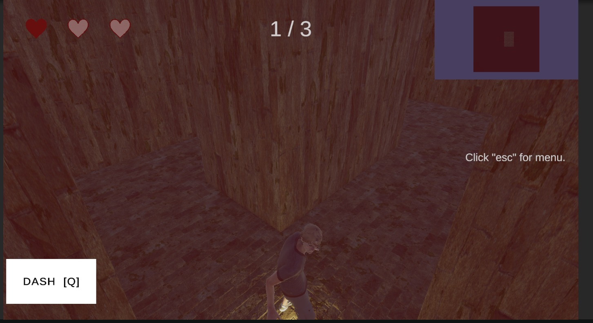
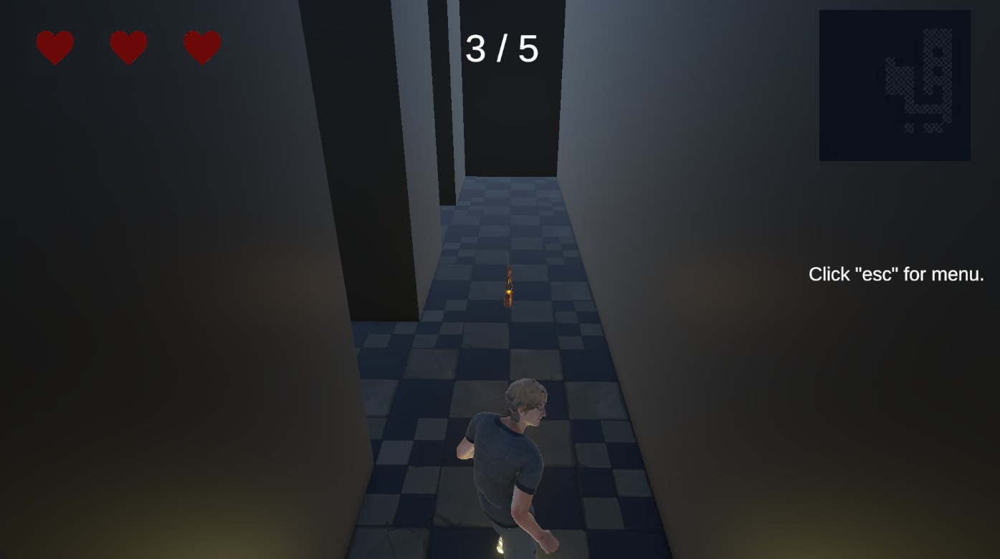
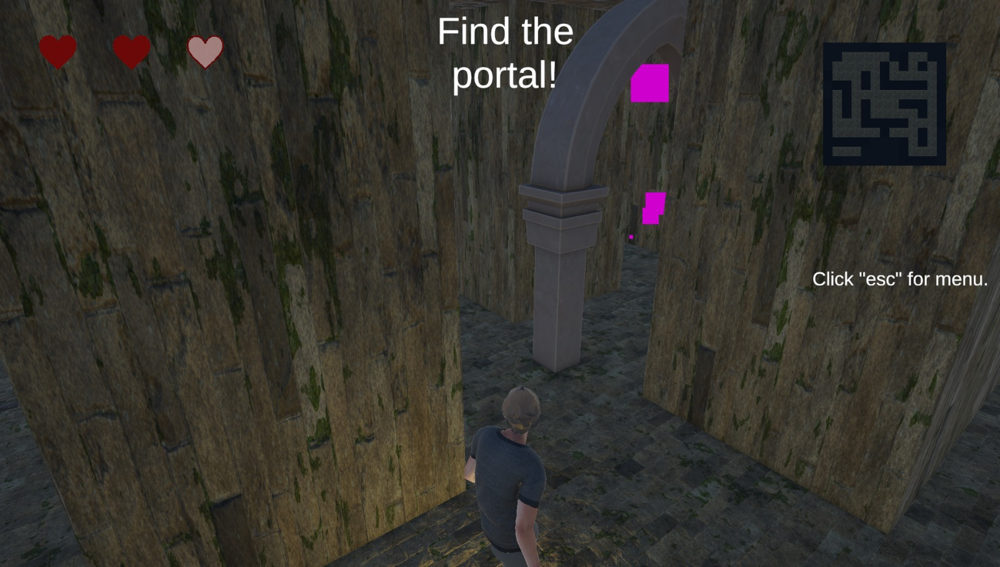
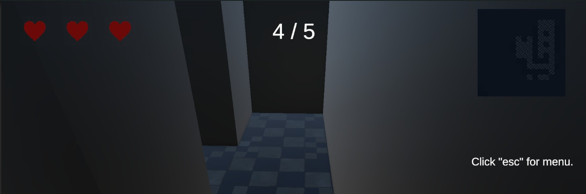
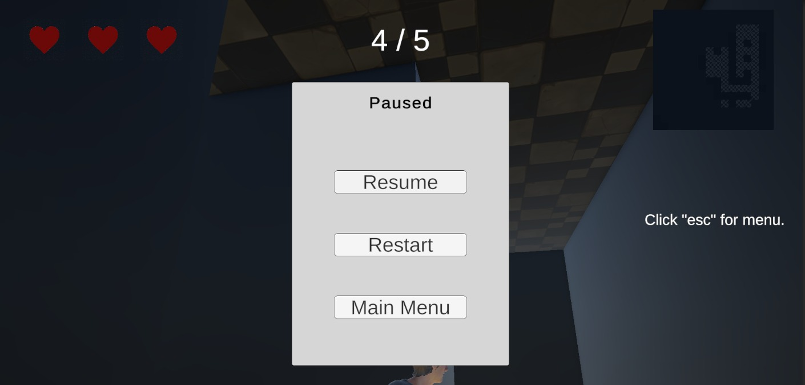
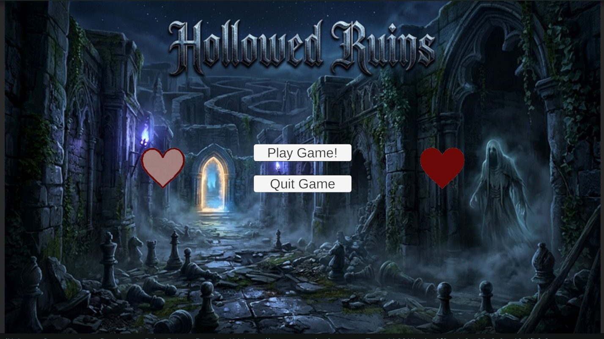
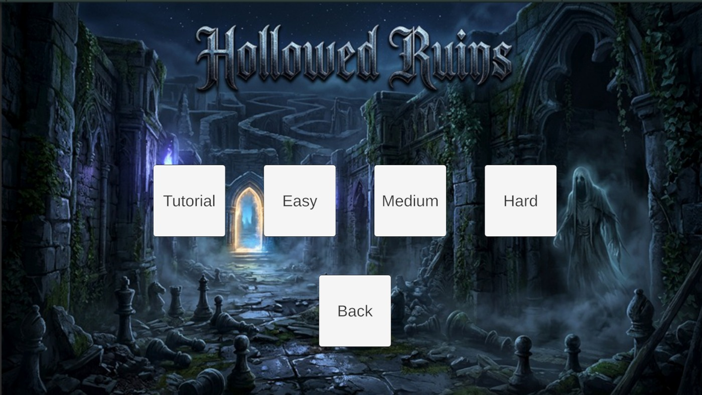

# HOLLOWED RUINS - GAME DESIGN & DEVELOPMENT DOCUMENT

Course: `CMPS434`
Section: `L01`
Instructor: `Dr. Osama Halabi`
Team: `Majid Marzouq (202309136), Oluwadamilola Olajide (202109926), Abdullah Hamed (202109951), Mohamad Allouh (201904335)`

---

## 1. Executive Overview

`Hollowed Ruins` is a single-player third-person horror exploration game built around two pressure loops:

- real-time survival inside a procedurally generated haunted maze
- turn-based chess duels triggered by enemy capture

The project’s unique identity comes from combining spatial tension with tactical problem solving. The player is never only running and never only thinking. Progress requires success in both spaces.

### Genre & Platform

- Genre: Horror Exploration / Puzzle Strategy
- Perspective: Third-person
- Platform: Windows PC
- Input: Keyboard and mouse, with Input System gamepad bindings available
- Player Count: Single-player
- Engine: Unity `6000.3.9f1`

### High Concept

The player enters a cursed fortress beneath Ashen Hollow and becomes trapped in the shifting ruins of Lord Aldric Voss, now reborn as the Warden. To escape, the player must recover the broken pieces of the Warden's Seal while avoiding capture. Each capture forces a chess duel. Each loss costs a heart. Three losses and the fortress claims another prisoner.

---

## 2. Narrative Direction

### The Legend

Deep beneath the hills of Ashen Hollow lies a fortress no map remembers. It was built by Lord Aldric Voss, a chess grandmaster, occultist, and tyrant who believed the mind was the truest prison. He designed the stronghold as an ever-shifting labyrinth and tested prisoners through ritualized chess contests, taking pieces of their lives whenever they lost.

When Aldric died, his will fused with the fortress itself. He became the Warden, a ghostly intelligence tied to the stone, the darkness, and the maze.

### The Player

The player is an urban explorer who enters the ruins searching for history and treasure, only to become trapped inside the living prison. The goal becomes survival, recovery of the shattered seal, and escape.

### Narrative Function Of Mechanics

- The maze supports the fiction of a fortress built to disorient and imprison
- The chess duels reinforce Aldric's identity and rule set
- The broken key pieces externalize the escape arc into visible objectives
- The heart system translates psychological loss into readable gameplay stakes

---

## 3. Design Goals

- Deliver constant tension during exploration
- Make every encounter with the Warden memorable and readable
- Ensure the chess layer feels like a feature, not a gimmick
- Keep failure punishing, but not unfair
- Use audio, UI, and level layout to maintain horror pressure
- Support quick understanding for first-time players

---

## 4. Core Player Experience

### Core Loop

1. Spawn into a generated maze
2. Explore corridors and search for key pieces
3. Manage line-of-sight and sound exposure
4. Get caught or evade the Warden
5. Resolve a chess duel if captured
6. Resume exploration
7. Unlock and reach the portal

_Figure 1. Core gameplay flow showing exploration, Warden pressure, chess duel resolution, and escape progression._

### Failure Loop

1. Warden catches player
2. Chess duel begins
3. Player loses duel
4. One heart is removed
5. Exploration resumes with increased tension
6. At zero hearts, game over

---

## 5. Gameplay Layers

### Layer 1 - Real-Time Exploration

- Third-person navigation through a generated maze
- Collectible key piece placement across valid corridor cells
- Ghost pressure through patrol, chase, and investigation states
- Minimap-assisted exploration with fog-of-war reveal
- Audio-driven stealth pressure through movement noise and pickup noise

### Layer 2 - Chess Duel Encounters

- Triggered by direct capture from the Warden
- 4x4 board size
- Objective-based scenarios instead of full-length chess matches
- Turn-based pacing during a paused exploration state
- Result determines whether the player escapes or loses a heart

---

## 6. Player Rules & Progression

### Player State

- The player begins with `3 hearts`
- Hearts are lost only through failed chess duels
- Hearts are not restored during the current design scope

### Objectives

- Find all key fragments in the current maze
- Trigger portal reveal by completing collection
- Reach the portal before all hearts are lost

### Win / Lose Conditions

| Condition                                     | Result    |
| --------------------------------------------- | --------- |
| Collect all key pieces and enter the portal   | Win       |
| Lose all 3 hearts through chess duel failures | Game Over |

---

## 7. Special Mechanics

### Warden Capture Duels

The central special mechanic of the game is the conversion from chase gameplay into board-based challenge gameplay. This creates a rhythm of panic followed by tactical problem solving.

### Noise System

- Walking emits a moderate noise radius
- Sprinting emits a larger noise radius
- Key pickups emit a large noise pulse
- The Warden can investigate sound without direct line of sight

### Final Heart Mode

When the player reaches one heart:

- `Q` activates a dash with a cooldown
- `Space` enables jump
- Sprinting receives a speed multiplier
- A heartbeat overlay warns the player visually
- Dash cooldown is surfaced through the HUD

_Figure 2. Final-heart mode presentation, where survival pressure is heightened through emergency mobility and visual feedback._

### Procedural Layout

The maze layout changes per run, but remains readable and solvable.

### Minimap Fog

The minimap reveals explored cells over time, giving a measured sense of progress without fully removing uncertainty.

---

## 8. Level Design

### Maze Generation Philosophy

The maze is generated at runtime and is intended to feel:

- claustrophobic
- navigable
- unpredictable
- fair

### Generation Characteristics

- Recursive backtracking is used as the base carving method
- A central 2x2 open hall guarantees reliable spawn space
- Additional gap creation introduces loops and reduces single-path predictability
- Runtime NavMesh baking enables dynamic enemy navigation after layout generation

### Placement Rules

After generation, the maze places:

- player spawn
- Warden spawn
- exit portal
- key pieces

The portal begins hidden and is only revealed after all key pieces are collected.

_Figure 3. Key fragment collectible used to drive exploration progress and portal unlock conditions._

_Figure 4. Exit portal presentation after objective completion, serving as the final escape target for the player._

### Level Profiles

| Level    |  Maze | Keys | Patrol Speed | Chase Speed |
| -------- | ----: | ---: | -----------: | ----------: |
| Tutorial |   7x7 |    2 |            3 |           6 |
| Easy     | 12x12 |    3 |            4 |           8 |
| Medium   | 15x15 |    4 |            5 |           9 |
| Hard     | 17x17 |    5 |            6 |          10 |

---

## 9. Enemy Design - The Warden

### Role

The Warden is the game’s primary antagonist and pressure source.

### Behavior States

| State  | Description                                       |
| ------ | ------------------------------------------------- |
| Patrol | Moves through the maze using NavMesh destinations |
| Chase  | Pursues the player after detection                |
| Stun   | Temporarily halted after certain duel outcomes    |

### Detection Model

- Vision cone detection through distance and angle checks
- Raycast blocking through walls
- Sound investigation through `NoiseSystem`

### Encounter Resolution

- If the Warden catches the player, the game enters `ChessDuel`
- If the player wins the duel, the Warden vanishes and relocates
- If the player loses the duel, the Warden is briefly stunned and the player loses one heart

---

## 10. Chess Duel Design

### Intent

Chess encounters are designed to:

- reinforce the antagonist's identity
- shift the player into a slower but still tense decision space
- create replayable challenge variation through scenario content

### Duel Rules

- Board size: `4x4`
- Player side: White
- Enemy side: Black
- Scenario based, not full match based
- No real-time timer per move in the current implementation

### Objective Types

- `DontLosePiece`
- `ProtectPiece`
- `CaptureTarget`
- `SurviveNTurns`

### Example Encounter Goals

- Survive for 3 turns
- Protect the bishop for 2 turns
- Capture a target piece before turns run out
- Avoid losing any white piece

### Chess AI Philosophy

The ghost AI uses a lightweight minimax-based move choice. This keeps the duel system readable and consistent without overbuilding a full tournament-grade chess engine.

---

## 11. Player-Facing UI / UX

### HUD Elements

| Element           | Purpose                              |
| ----------------- | ------------------------------------ |
| Hearts            | Read remaining lives                 |
| Key Counter       | Track objective progress             |
| Portal Prompt     | Signal exit phase                    |
| Ghost Warning     | Signal chase state                   |
| Minimap           | Support navigation and discovery     |
| Heartbeat Overlay | Emphasize danger in final-heart mode |
| Dash Indicator    | Show cooldown and readiness          |

### UX Priorities

- Keep state changes legible
- Make danger escalation obvious
- Keep objective communication short and direct
- Let the chess UI clearly communicate valid moves and turn pressure

_Figure 5. Exploration HUD showing hearts, objective tracking, and high-priority player feedback._

_Figure 6. In-game UI composition and visual framing used to support readability during high-tension moments._

---

## 12. Audio Direction

### Audio Intent

Audio should do more than decorate the environment. It should function as tension delivery and behavioral feedback.

### Current Audio Categories

- Ambient ruins track
- Ghost alert cue
- Ghost roar cue
- Chess duel music
- Player footstep audio

### Audio Use Cases

- Ambient layers establish dread
- Alert cues reinforce Warden state changes
- Duel music marks the transition into tactical mode
- Footsteps increase spatial awareness and stealth pressure

---

## 13. Scene & Build Structure

### Build Scenes

- `Assets/_Scenes/MainMenu.unity`
- `Assets/_Scenes/LevelTutorial.unity`
- `Assets/_Scenes/LevelEasy.unity`
- `Assets/_Scenes/LevelMedium.unity`
- `Assets/_Scenes/LevelHard.unity`

### Menu Flow

- Main menu
- Level select
- Gameplay scene
- Win / Game Over return flow

_Figure 7. Main menu presentation used as the front-end entry point for the game experience._

_Figure 8. Level select interface used to route players into tutorial and difficulty-based gameplay scenes._

---

## 14. Technical Architecture

### Core Runtime Folders

| Folder           | Responsibility                                    |
| ---------------- | ------------------------------------------------- |
| `Scripts/Core`   | Game state, health, noise, level tuning           |
| `Scripts/Player` | Player movement and spawn support                 |
| `Scripts/Maze`   | Procedural generation, collection, exit flow      |
| `Scripts/Ghost`  | AI, animation bridge, enemy support               |
| `Scripts/Chess`  | Duel rules, board logic, scenarios, evaluator, AI |
| `Scripts/UI`     | HUD, minimap, menus, duel board, screens          |

### Key Systems

| System                  | Responsibility                                                     |
| ----------------------- | ------------------------------------------------------------------ |
| `GameStateManager`      | Global state control between exploration, duel, win, and game over |
| `HealthSystem`          | Heart tracking and defeat trigger                                  |
| `NoiseSystem`           | Broadcasts sound events to AI                                      |
| `LevelConfig`           | Difficulty tuning per scene                                        |
| `PlayerController`      | Movement, look, sound emission, last-heart abilities               |
| `MazeGenerator`         | Runtime maze generation, object placement, NavMesh prep            |
| `PieceCollectionSystem` | Key tracking and portal reveal                                     |
| `GhostAI`               | Warden state machine and pursuit logic                             |
| `ChessDuelManager`      | Duel orchestration and resolution                                  |
| `ChessBoard`            | Pure 4x4 board logic                                               |
| `GhostChessAI`          | Enemy move selection in duels                                      |
| `HUDController`         | Exploration HUD and warning systems                                |
| `UIManager`             | Screen visibility by game state                                    |

---

## 15. Content Inventory

### Environment

- `Assets/DungeonModularPack`
- Runtime-built floor and wall arrangement

### Character / Animation

- `Assets/Art/Mixamo`
- `Assets/Art/Animations`
- `PlayerAnimator.controller`
- `CreepAnimator.controller`

### Audio

- `Assets/Audio/Ambient/Ambient ruins.mp3`
- `Assets/Audio/Music/Chess_duel.mp3`
- `Assets/Audio/SFX/Ghost_Alert.mp3`
- `Assets/Audio/SFX/Ghost_Roar.mp3`
- `Assets/Audio/SFX/FootSteps_Run.wav`

### UI

- `Assets/UI`
- `Assets/UI/Sprites/Chess_Pieces`
- `Assets/TextMesh Pro`

---

## 16. Production Notes

### Scene Setup Expectations

Each gameplay scene should contain:

- a managers root with state, health, collection, noise, and duel systems
- a maze root with generator and NavMesh surface
- a player with `CharacterController`, `PlayerInput`, and `PlayerController`
- a Warden object with `NavMeshAgent`, `GhostAI`, and `GhostAnimator`
- a UI canvas with HUD, duel UI, and result screens
- a minimap camera

### Current Debug Notes

`PlayerController` currently includes:

- `P` to force a chess duel
- `L` to remove one heart

These are useful for testing, but should be removed or gated before final submission.

### Architectural Risks / Notes

- `GameStateManager` uses `DontDestroyOnLoad`, so duplicate manager setups must be avoided
- `MainMenuManager` stores scene names as Inspector strings
- `PlayerSpawner` and `GhostSpawner` appear legacy compared with the current procedural actor positioning path
- `ChessBoardUI` includes a `lastMoveColor` field that is currently unused in the refresh path

---

## 17. Scope Definition

### Current MVP Scope

- Procedural maze generation
- Key collection and portal reveal
- One ghost enemy with patrol, chase, stun, and sound reaction
- Chess duel mode with multiple scenario objectives
- 3-heart life system
- Exploration HUD and minimap
- Main menu and difficulty scenes

### Stretch Opportunities

- Additional Warden types or patrol styles
- More chess scenarios
- Environmental hazards
- Story pickups and lore fragments
- Additional difficulty modifiers

### Out Of Scope

- Multiplayer
- Open world exploration
- Full competitive chess engine
- RPG progression systems

---

## 18. Team Responsibilities

| Member | Role | Deliverables |
| --- | --- | --- |
| Majid Marzouq (202309136) | Programmer | Maze generation, player movement, ghost AI, chess system, health system, noise system, technical gameplay implementation |
| Oluwadamilola Olajide (202109926) | Level Designer | Level layout, gameplay space design, maze tuning, environmental setup, pacing of exploration spaces, animation integration |
| Abdullah Hamed (202109951) | Sound, Music & 2D Elements | Ambient ruins audio, ghost alert cues, chess duel music, scream SFX, sprites, HUD-facing 2D elements |
| Mohamad Allouh (201904335) | Story Teller & Presentation | Narrative development, story direction, lore framing, presentation structure, project presentation support |

---

## 19. Competitive Reference

- `The Ouroboros King` for tactical puzzle identity
- `Phantom Abyss` for pressured exploration and threat presence

Differentiation:

The Warden is both hunter and strategist. The player does not simply evade danger or solve isolated puzzles. They must survive pursuit and defeat the mind behind the prison.

---

_Last updated: 2026-05-09_
